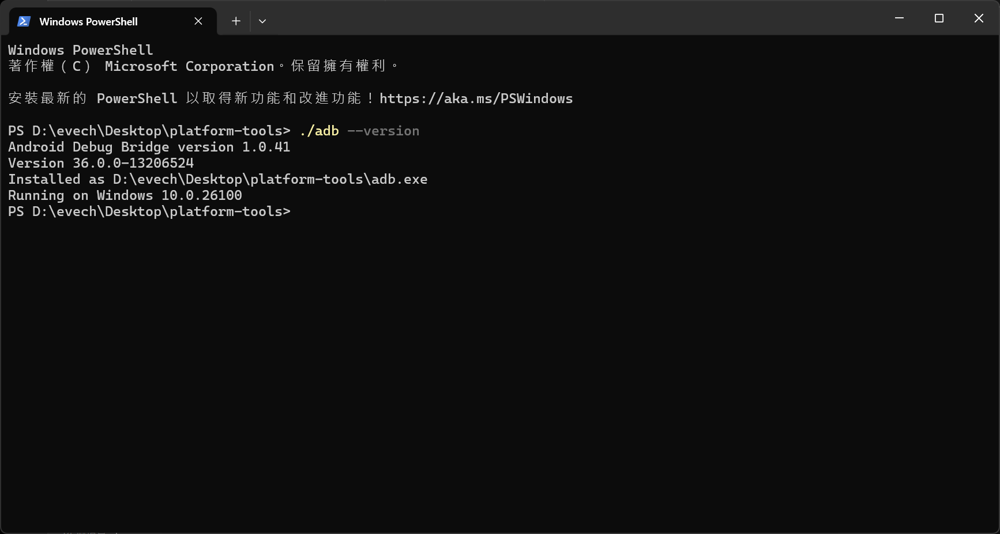

# ADB
  

ADB全稱Android Debug Bridge，是一個~~能夠駭進你朋友手機的工具~~。可以透過ADB從電腦安裝應用程式、拷貝系統、解鎖bootloader等，常用來刷機。  
ADB隨附於Android Studio，也可以手動下載不含IDE的輕量工具→[下載處](https://developer.android.com/tools/releases/platform-tools?hl=zh-tw)
