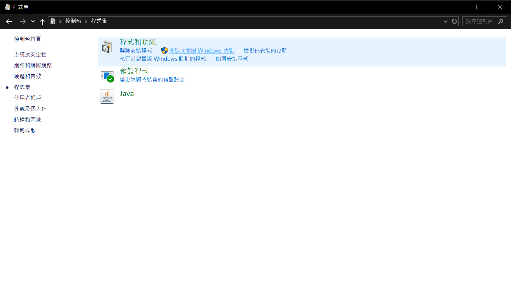
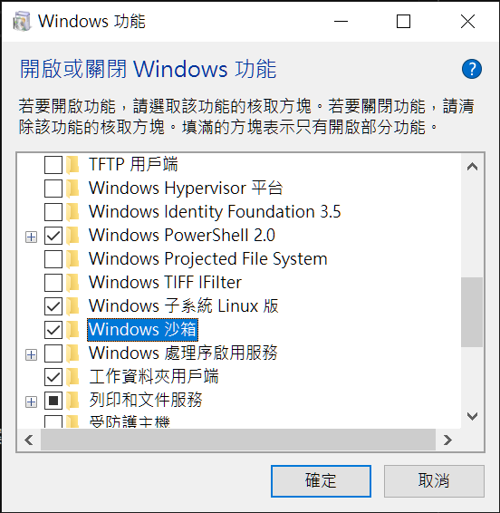

# Windows Sandbox

Windows 沙箱(Windows Sandbox) 是Windows Pro 版的附加的可選元件。可以即時產生一個Windows容器，且關閉後不會留下任何痕跡。適合拿來測試應用程式的安全性。

# 開啟Sandbox 功能

  
打開控制台>程式集>開啟或關閉Windows 功能

  
若是Professional版的Windows應該會有`Windows 沙箱`的選項，啟用它  
等待安裝並重新啟動後，在開始就可以找到Windows Sandbox  

# 將資料夾映射進Sandbox

Windows Sandbox的副檔名為`.wsb`，使用XML格式  

> - 範例  
創建一個文字文件，並把下列內容複製貼上
```XML
<Configuration>
  <MappedFolders>
    <MappedFolder>
      <HostFolder>[PATH]</HostFolder>
      <ReadOnly>false</ReadOnly>
    </MappedFolder>
  </MappedFolders>
</Configuration>
```
> - 將要映射進Sandbox的資料夾目錄填入[PATH]，保存後並把附檔名改成`.wsb`。打開檔案之後設定的目錄就會出現在沙箱的桌面
