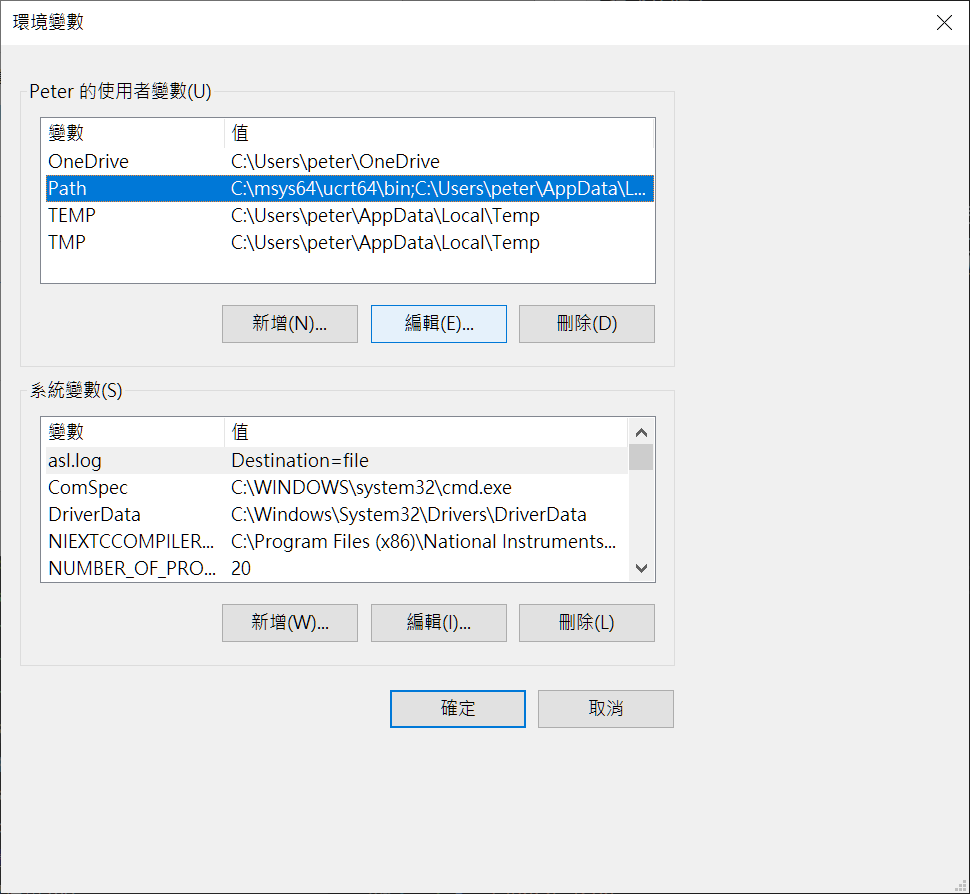
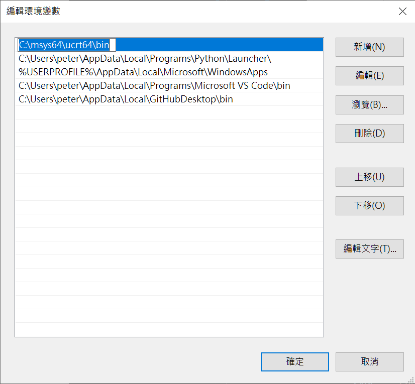

# msys2
 msys2是個輕量級類Unix shell ，可以安裝MinGW64等編譯器。  
官網&下載鏈結:[msys2](https://www.msys2.org)  
 
# pacman
`pacman`是一種Linux的程式版本控制器，被Arch Linux採用。而msys2也是用`pacman`管理安裝程式的版本。  

# 建置
下載msys2  
安裝好之後應該會有數個Linux 終端，推薦使用urct64  
打開終端，執行更新指令`pacman -Syu`  
待更新完成後再下載編譯器之類的組建。  
編譯器等系組件的Package可以在[package查詢頁面](https://packages.msys2.org/queue)找到，像是[gcc](https://packages.msys2.org/packages/mingw-w64-ucrt-x86_64-gcc)，基本上安裝時會自動安裝依賴項，但編譯出錯時還是要手動檢查是否有缺少或衝突。  

# 下載好gcc，替換VSCode 的編譯器
1. 將`urct64-gcc`加入使用者PATH  
> 1. 在Windows 開始搜尋`檢視進階系統設定`  
  
> 2. 點選環境變數  
  
> 3. 找到使用者變數`PATH`  
  
> 4. 將gcc編譯器的路徑(預設為圖片中的路徑)加入使用者PATH  
  

確認更改生效，可以在`CMD.exe`輸入  
`gcc --version` 或 `g++ --version`  
應該會顯示  
```CMD.exe
C:\Users\peter>g++ --version
g++ (Rev8, Built by MSYS2 project) 15.2.0
Copyright (C) 2025 Free Software Foundation, Inc.
This is free software; see the source for copying conditions.  There is NO
warranty; not even for MERCHANTABILITY or FITNESS FOR A PARTICULAR PURPOSE.


C:\Users\peter>gcc --version
gcc (Rev8, Built by MSYS2 project) 15.2.0
Copyright (C) 2025 Free Software Foundation, Inc.
This is free software; see the source for copying conditions.  There is NO
warranty; not even for MERCHANTABILITY or FITNESS FOR A PARTICULAR PURPOSE.
```


編輯`.vscode`的工作區設定  
範例:
```PATH
project
    L .vscode
        L launch.json
          setting.json
          tasks.json
```
> - `launch.json`
```json
{
    "version": "0.2.0",
    "configurations": [
        {
            "name": "C++: MSYS2_ucrt64",
            "type": "cppdbg",
            "request": "launch",
            "program": "${workspaceFolder}/main.exe",
            "args": [],
            "stopAtEntry": false,
            "cwd": "${workspaceFolder}",
            "environment": [
                {
                    "name": "PATH",
                    "value": "C:/msys64/ucrt64/bin;${env:PATH}"
                }
            ],
            "externalConsole": true,
            "MIMode": "gdb",
            "miDebuggerPath": "C:/msys64/ucrt64/bin/gdb.exe",
            "setupCommands": [
                {
                    "description": "啟用漂亮列印",
                    "text": "-enable-pretty-printing",
                    "ignoreFailures": true
                }
            ]
        }
    ]
}
```
> - `tasks.json`
```json
{
    "version": "2.0.0",
    "tasks": [
        {
            "label": "build with ucrt64 g++",
            "type": "shell",
            "command": "C:/msys64/ucrt64/bin/g++.exe",
            "args": [
                "-fdiagnostics-color=always",
                "-g",
                "${workspaceFolder}/main.cpp",
                "-o",
                "${workspaceFolder}/main.exe"
            ],
            "group": "build",
            "problemMatcher": [
                "$gcc"
            ]
        },
        {
            "type": "cppbuild",
            "label": "C/C++: g++.exe 建置使用中檔案",
            "command": "C:\\msys64\\ucrt64\\bin\\g++.exe",
            "args": [
                "-fdiagnostics-color=always",
                "-g",
                "${file}",
                "-o",
                "${fileDirname}\\${fileBasenameNoExtension}.exe"
            ],
            "options": {
                "cwd": "C:\\msys64\\ucrt64\\bin"
            },
            "problemMatcher": [
                "$gcc"
            ],
            "group": {
                "kind": "build",
                "isDefault": true
            },
            "detail": "偵錯工具產生的工作。"
        }
    ]
}
```

