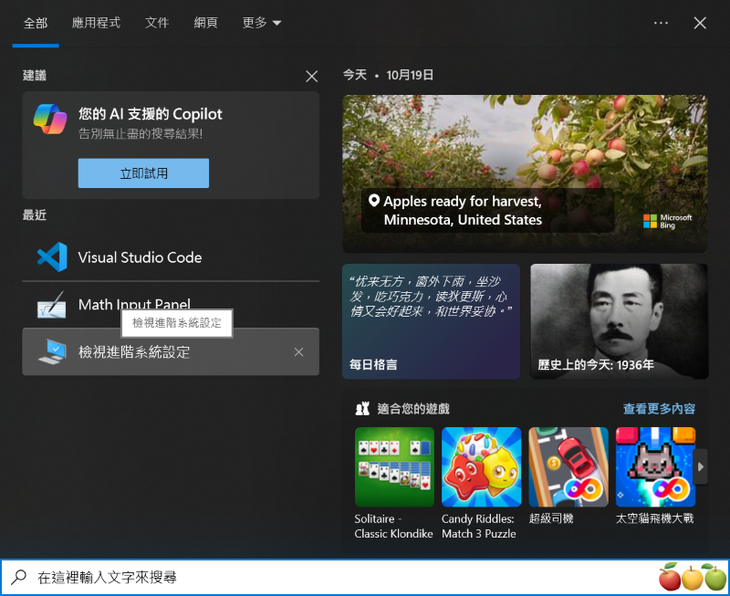
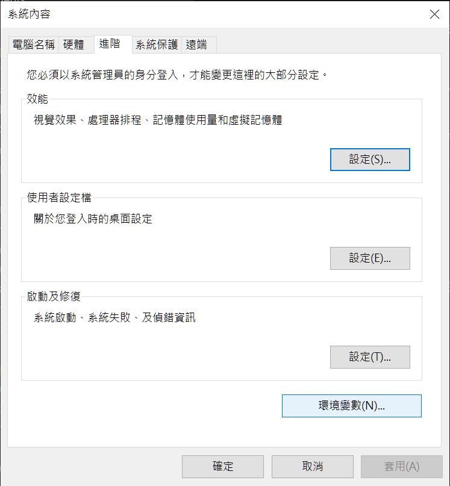
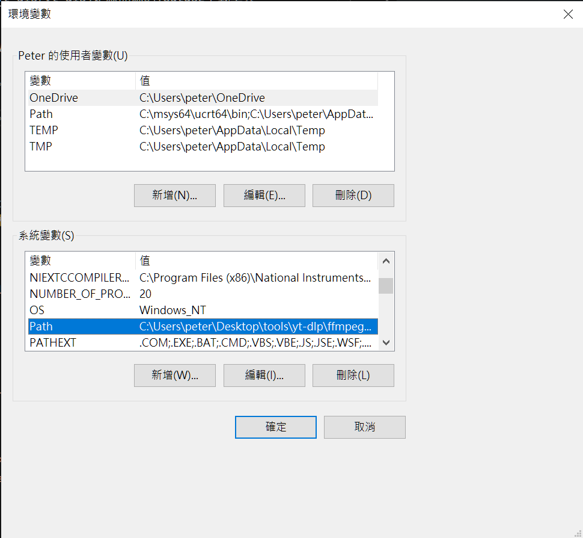
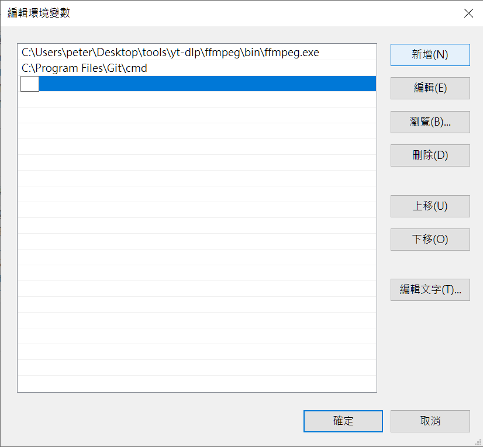

# yt-dlp教學

## 注意事項
本文僅作為學術分享，請勿用於非法用途。

## 開始
[yt-dlp](https://github.com/yt-dlp/yt-dlp) 是一款開源的 YouTube 下載工具，可以導入 cookie 來模仿使用者。
### Windows
將程式目錄加入 system PATH，就可以整合進 CMD。

在 Windows 搜索「檢視進階系統設定」  


找到環境變數  


在系統變數的 Path 選項按「編輯」  


點選新增，將 `yt-dlp.exe` 的路徑貼上並保存  


# 指令與參數  
`yt-dlp --version`列出版本號  

參數:  
`--list-formats` 列出所有格式  
`-f [options] <URL>` 下載指定格式  
*下載指定格式的影片和音訊是分開的，必須同時下載並合成  
`-U` 更新套件  

指定畫質  
`yt-dlp -f "bv[height<=<pixel>]+ba" <URL>`  

下載影片  
`yt-dlp <URL>` 預設1080p  

下載影片+字幕  
`yt-dlp --write-subs --embed-subs --sub-lang <language> <URL>`  

# 使用cookies  

`yt-dlp --cookies ["cookies PATH"] <URL>`   
`yt-dlp --cookies-from-browser <Browser> <URL>`  

# ffempg  

[ffmpeg](https://www.ffmpeg.org/download.html)是一款輕量強大的多媒體引擎

`ffmpeg -i <video> -i <audio> -c copy <output.mkv>`  
將下載的視訊和音訊檔按路徑貼在`<video>`和`<Audio>`的欄位裡，即可合併視訊和音訊檔案  

若是要分離視訊或音訊，可以使用下列命令

```bash
ffmpeg -i <input> -vn -acodec copy <audio.m4a>
ffmpeg -i <input> -an -vcodec copy <video.mp4>
```
將要目標檔案路徑貼入`<input>`並指定輸出檔名，輸出檔案將會儲存在命令列的工作目錄下

CPU Video Encode :
> - libx264    - H264
> - libsvtav1  - H265(Intel)
> - libaom-av1 - H265
> - libvpx-vp9 - VP9

GPU Video Encode (NVIDIA):
> - h264_nvenc  - H264
> - hevc_nvenc  - H265
> - av1_nvenc   - AV1
> - mjpeg_nvenc - MJPEG

GPU Video Encode (AMD Radeon):
> - h264_amf
> - hevc_amf
> - av1_amf

Android Video API
> - h264_mediacodec - H264
> - hevc_mediacodec - H265
> - av1_mediacodec  - AV1

Another :
> - prores_ks - Apple ProRes
> - ffv1      - FF Video Codec 1
> - gif       - output GIF

